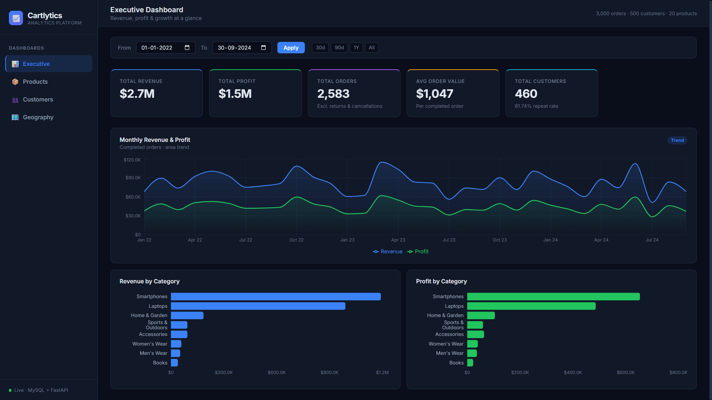
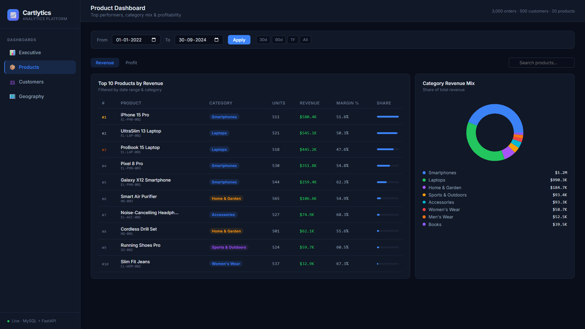
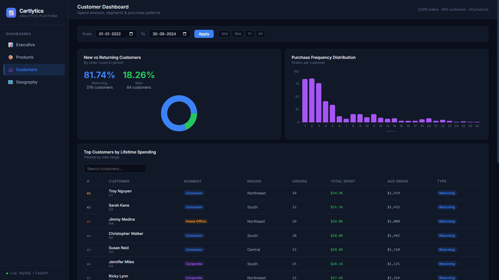
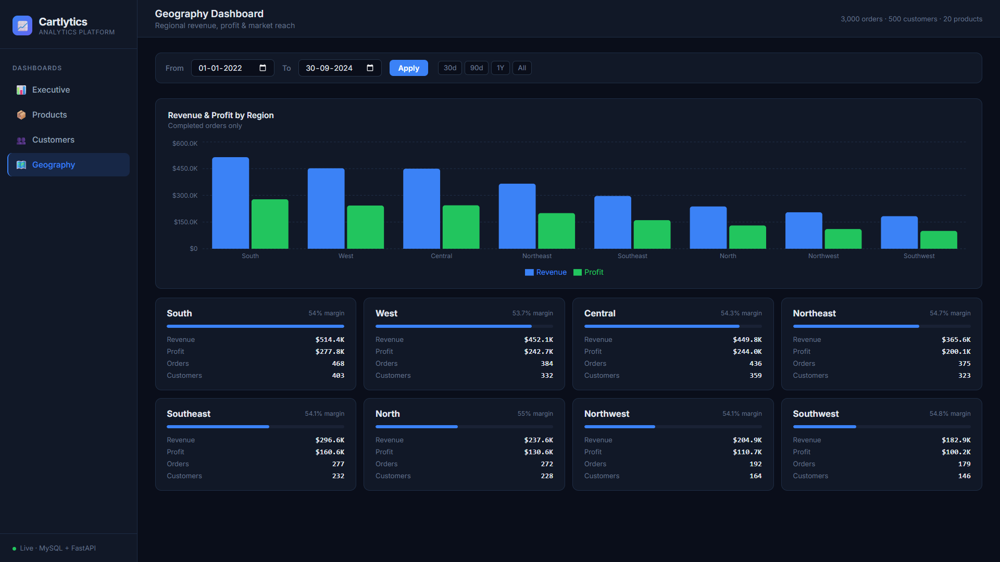

# Cartlytics 📈
## End-to-End Customer, Sales & Revenue Analytics Platform

A production-grade e-commerce analytics platform built as a **Data Analyst / Data Engineer portfolio project**. Cartlytics demonstrates a complete modern data pipeline: from generating synthetic datasets, extracting and loading them into a relational database, to serving them via a high-performance REST API, and finally visualizing them in a premium, responsive React dashboard.

> **Tech Stack:** Docker · MySQL · Python (Pandas) · FastAPI · React (Vite, Recharts) · Vanilla CSS

---

## Table of Contents

1. [Project Overview](#project-overview)
2. [Dashboards & Features](#dashboards--features)
3. [Architecture](#architecture)
4. [Quick Start (Docker Recommended)](#quick-start-docker-recommended)
5. [Local Development (Without Docker)](#local-development-without-docker)
6. [ETL Pipeline & Data Generation](#etl-pipeline--data-generation)
7. [Database & Schema](#database--schema)
8. [Backend API](#backend-api)
9. [Power BI Integration](#power-bi-integration)
10. [KPI Definitions](#kpi-definitions)

---

## Project Overview

Cartlytics was built to demonstrate how raw e-commerce data (customers, products, orders) can be transformed into actionable business intelligence. It features:
- **Synthetic Data Generation:** Custom python scripts that generate thousands of realistic e-commerce transactions, completely avoiding static, boring dummy data.
- **Robust ETL Pipeline:** A Pandas-powered script that extracts raw CSVs, cleans the data, enforces constraints, and loads it into MySQL.
- **High-Performance API:** A FastAPI backend utilizing SQLAlchemy to query complex SQL views, returning JSON analytics in milliseconds.
- **Premium Dashboard UI:** A highly responsive, modern, and dark-themed React frontend built without heavy UI libraries, utilizing Vanilla CSS for maximum performance and Recharts for beautiful visualizations.
- **Containerized Architecture:** Fully dockerized for a one-click "up and running" experience.

---

## Dashboards & Features

Cartlytics provides insights across four distinct domains:

| Dashboard    | What it answers                                            |
|--------------|------------------------------------------------------------|
| **Executive** | What is our high-level revenue, profit, and growth? How are we trending over time? |
| **Products**  | Which items drive the most revenue vs profit? What is our category mix and profit margin? |
| **Customers** | What is our repeat customer rate? How does purchase frequency distribute across segments? |
| **Geography** | Which regions are performing best? Where is our strongest market penetration? |

### Screenshots


| Executive Dashboard | Products Dashboard |
|:---:|:---:|
|  |  |

| Customers Dashboard | Geography Dashboard |
|:---:|:---:|
|  |  |

---

## Architecture

```text
[ Synthetic CSV Datasets ]
          │
          ▼
[ ETL Pipeline (Python/Pandas) ]
          │  cleans, validates, calculates line_revenue/profit
          ▼
[ MySQL Database (Docker) ]
          │  normalized schema + analytics views
          ▼
[ FastAPI Backend (Docker) ]
          │  repositories → services → routers → REST endpoints
          ▼
[ React Frontend (Docker) ]        [ Power BI ]
  Recharts + date filters          CSV exports from MySQL views
```

---

## Quick Start 

The easiest way to get Cartlytics running is using Docker. This will spin up the database, the API backend, and the React frontend simultaneously.

### Prerequisites
- Docker and Docker Compose
- Python 3.11+ (for the ETL pipeline)

### 1. Clone & Configure
```bash
git clone https://github.com/01MASTERS/cartlytics
cd cartlytics
cp .env.example .env
```
*(The `.env` file comes pre-configured for the Docker setup. Ensure `DB_PORT=3307` to avoid conflicts with any local MySQL).*

### 2. Spin up the containers
```bash
docker compose up --build -d
```
This starts:
- **MySQL Database:** Exposes port `3307` to your host.
- **FastAPI Backend:** Runs on `http://localhost:8000`.
- **React Frontend:** Runs on `http://localhost:5173`.

### 3. Generate Data & Run ETL
Because the database starts empty, you need to generate the synthetic data and run the ETL script to populate it. 
We'll run this *inside* the Docker container so you don't even need to worry about local Python dependencies!

```bash
# Run the ETL script directly inside the backend container
docker run --rm -v "%cd%:/workspace" --network cartlytics_default -e DB_HOST=db -e DB_PORT=3306 -e DB_USER=cartlytics_user -e DB_PASSWORD=cartlytics_pass -e DB_NAME=cartlytics cartlytics-backend python /workspace/scripts/etl_pipeline.py
```
*(Note: If you are on Mac/Linux, replace `%cd%` with `$(pwd)`)*

### 4. View the Dashboard
Open your browser and navigate to:
👉 **[http://localhost:5173](http://localhost:5173)**

---

## Local Development (Without Docker)

If you prefer to run things natively without Docker:

**1. Database**
Ensure MySQL 8.0+ is running.
```bash
mysql -u root -p -e "CREATE DATABASE cartlytics CHARACTER SET utf8mb4;"
mysql -u root -p cartlytics < database/migrations/001_initial_schema.sql
```
Update your `.env` file with your local MySQL credentials.

**2. Backend & ETL**
```bash
# Setup Python environment
cd backend
python -m venv venv
source venv/bin/activate       # Windows: venv\Scripts\activate
pip install -r requirements.txt
cd ..

# Generate Data and Run ETL
pip install faker pandas mysql-connector-python python-dotenv
python scripts/generate_datasets.py
python scripts/etl_pipeline.py

# Start API
cd backend
uvicorn app.main:app --reload --host 0.0.0.0 --port 8000
```

**3. Frontend**
```bash
cd frontend
npm install
npm run dev
```

---

## ETL Pipeline & Data Generation

### 1. Data Generation (`generate_datasets.py`)
Uses the `Faker` library to generate thousands of realistic e-commerce rows across 5 tables (`categories`, `products`, `customers`, `orders`, `order_items`). It introduces realistic nuances like varying purchase frequencies, different shipping statuses, and applied discounts.

### 2. ETL Process (`etl_pipeline.py`)
| Step | Action |
|------|--------|
| **Extract** | Load raw CSVs with `pandas.read_csv` |
| **Transform** | Drop duplicates, coerce datatypes, validate enums, truncate long strings, and recalculate derived financial metrics (`line_revenue`, `line_profit`). |
| **Load** | Disables Foreign Key constraints temporarily, truncates old tables, and bulk inserts data in batches of 500 rows. |

---

## Database & Schema

### Key Design Decisions
- **Monetary Types:** All monetary columns use `DECIMAL(14,2)` – never `FLOAT`.
- **Pre-calculation:** `line_revenue`, `line_cost`, `line_profit` are pre-calculated at insert time for optimal query performance.
- **Analytics Views:** Five optimized MySQL views abstract complex repetitive joins: `vw_monthly_sales`, `vw_category_sales`, `vw_product_performance`, `vw_customer_stats`, `vw_regional_sales`.
- **Indexing:** Indexes placed on all Foreign Key columns and heavily filtered columns (`order_date`, `status`, `region`).

---

## Backend API

The FastAPI backend follows a clean, layered architecture:
```text
Router (HTTP) → Service (Logic) → Repository (SQL) → MySQL
```
All endpoints accept `start_date` and `end_date` query parameters for dynamic dashboard filtering.

**Core Routes:**
- `GET /api/v1/kpis` - High-level metrics and growth percentages.
- `GET /api/v1/sales/monthly` - Time-series revenue and profit data.
- `GET /api/v1/products/top-revenue` - Top performing products.
- `GET /api/v1/customers/purchase-frequency` - Order distribution among segments.

---

## Power BI Integration

The platform includes a script to generate flat, optimized CSVs for external BI tools like Power BI or Tableau.

```bash
python scripts/export_powerbi.py
# Files exported to → datasets/powerbi_exports/
```


---

## KPI Definitions

| KPI | Formula |
|-----|---------|
| **Total Revenue** | `SUM(line_revenue)` where status ∉ {returned, cancelled} |
| **Total Profit** | `SUM(line_profit)` = `SUM(line_revenue - line_cost)` |
| **Total Orders** | `COUNT(DISTINCT order_id)` |
| **Avg Order Value** | `Total Revenue / Total Orders` |
| **Revenue Growth %** | `(Current − Prior) / ABS(Prior) × 100` |
| **Repeat Customer Rate** | `Customers with >1 order / Total Customers × 100` |
| **Profit Margin %** | `Total Profit / Total Revenue × 100` |

---

*Built with ❤️ as a portfolio project demonstrating modern end-to-end analytics engineering.*
